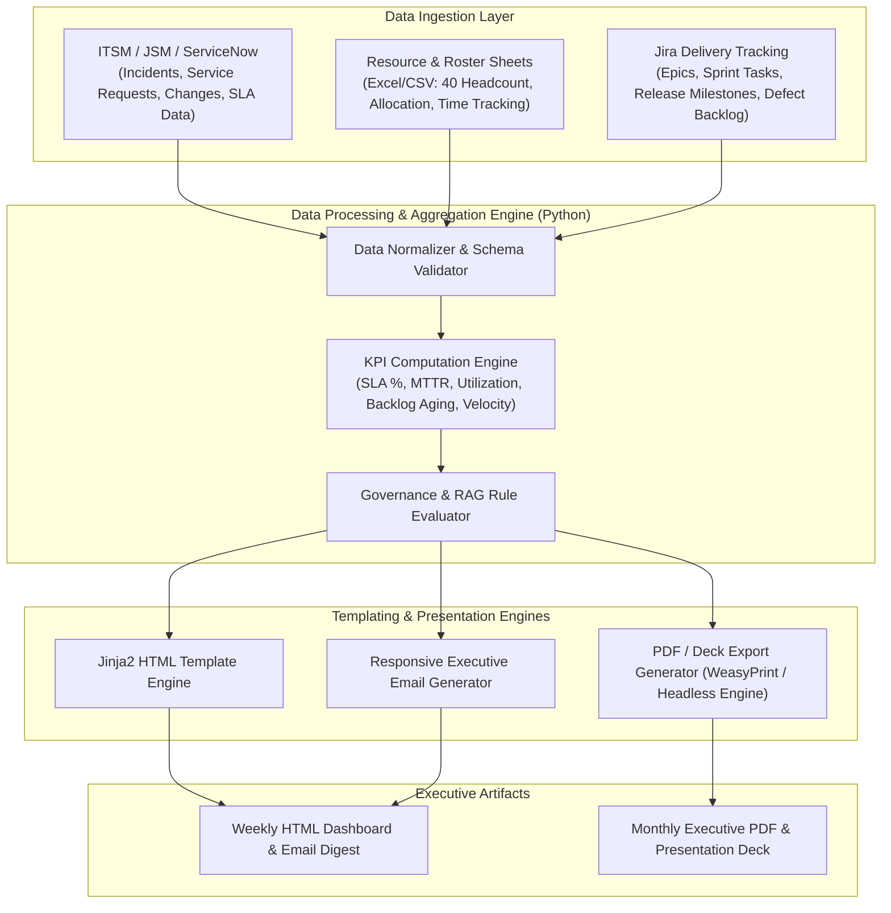
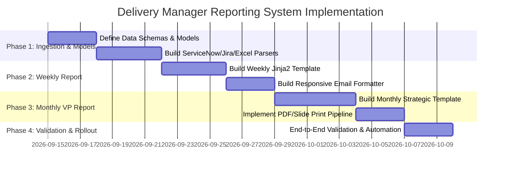

# Module 08 Completion Report

## Tracked Files
PROJECT_IDEAS.md
calculator/main.py
calculator/operations.py
hello-genai/project-jira-automation/README.md
hello-genai/project-jira-automation/data/sample_jira_export.json
hello-genai/project-jira-automation/scripts/generate_report.py
hello-genai/work/module-03-report.md
hello-genai/work/module03-task
hello.txt
project_spec.md

## Spec Commit History
f9d9861 (HEAD -> main) Add project technical specification

## project_spec.md Contents
# Technical Specification: Executive Delivery Management Reporting System (CTCO-AMS)

## 1. Executive Summary & Objective

### 1.1 Context
- **Project**: CTCO-AMS (Application Management & Support / Continuous Engineering)
- **Role**: Delivery Manager
- **Team Size**: 40 Team Members (Engineers, Leads, AMS Analysts, Support Pods)
- **Target Audience**: Vice President (VP) of Delivery & Engineering, Executive Stakeholders, PMO

### 1.2 Purpose
Establish an automated, standardized reporting framework that translates complex AMS operational data, delivery milestones, resource utilization, and executive governance into concise, actionable Weekly and Monthly VP reports.

---

## 2. Stakeholder Requirements & Delivery Cadences

| Dimension | Weekly Report (Tactical Operational) | Monthly Report (Strategic Executive) |
| :--- | :--- | :--- |
| **Target Audience** | VP, Delivery Heads, Operations Leads | VP, Business Unit Executives, Client Leadership |
| **Primary Focus** | Immediate health, 7-day RAG, active blockers, weekly SLA adherence, high-priority incident triage. | Macro SLA & MTTR trends, capacity/utilization across 40 FTEs, monthly delivery milestones, financial/cost governance, continuous improvements. |
| **Time Window** | Trailing 7 Days | Trailing Calendar Month / 30 Days |
| **Output Format** | Interactive HTML Dashboard + Responsive Executive Email Digest | Executive PDF / Slide-Ready Presentation + Consolidated HTML Dashboard |
| **Actionability** | Fast tactical interventions, blocker unblocking, escalation awareness. | Strategic staffing decisions, contract SLA reviews, roadmap planning, executive client alignment. |

---

## 3. Data Sources & Ingestion Architecture



### 3.1 Input Data Sources
1. **ITSM / JSM / ServiceNow Exports (`tickets.json` / CSV)**:
   - Ticket ID, Priority (`P1`-`P4`), Category (Incident, Service Request, Problem, Change), Status (`Open`, `In Progress`, `Resolved`, `Closed`).
   - Timestamps: Created, Acknowledged, Resolved, Closed.
   - SLA Targets & Breaches (Response SLA, Resolution SLA).
2. **Timesheets & Resource Rosters (`roster_allocation.xlsx` / CSV)**:
   - 40 Resource Records: Employee ID, Name, Role, Pod/Track (e.g., Core AMS, Enhancements, L2/L3 Support, DevOps).
   - Planned Hours, Actual Logged Hours, Billable Status, Leaves/PTO, On-Call Shifts.
3. **Delivery & Jira Milestones (`jira_delivery.json` / API)**:
   - Sprints, Epics, Planned vs. Completed Story Points, Release Milestones, Blockers.

---

## 4. Key Performance Indicators (KPIs) & Computation Formulas

### 4.1 AMS Operational KPIs
- **Overall SLA Adherence (%)**:
  $$\text{SLA Compliance Rate} = \left( \frac{\text{Total Tickets Met SLA}}{\text{Total SLA-Eligible Tickets}} \right) \times 100\%$$
- **Mean Time to Resolve (MTTR)**:
  $$\text{MTTR} = \frac{\sum (\text{Resolution Timestamp} - \text{Creation Timestamp})}{\text{Total Resolved Tickets}}$$
- **Ticket Inflow vs. Outflow**: Net change in backlog $= \text{Tickets Created} - \text{Tickets Resolved}$.
- **Backlog Aging Distribution**: Stratified into $0\text{--}7\text{ days}$, $8\text{--}30\text{ days}$, $30\text{--}60\text{ days}$, and $>60\text{ days}$.

### 4.2 Resource Utilization (40 Team Members)
- **Billable Utilization (%)**:
  $$\text{Utilization} = \left( \frac{\text{Billable Logged Hours}}{\text{Total Available Capacity Hours}} \right) \times 100\%$$
- **Pod Capacity & Headcount Distribution**: Tracking load distribution across support pods to identify burnout risks.

### 4.3 Engineering & Delivery Health
- **Milestone Completion Rate (%)**: Planned vs. actual release deliverable progress.
- **Sprint Commitment Reliability**: $\frac{\text{Delivered Story Points}}{\text{Committed Story Points}} \times 100\%$.

### 4.4 Executive Governance & RAG Criteria
- **Overall Project RAG**:
  - **Green (G)**: SLA $\ge 98\%$, zero unresolved P1 incidents, schedule variance $< 5\%$, utilization between $85\text{--}95\%$.
  - **Amber (A)**: SLA $95\text{--}97.9\%$, $1$ isolated P1 resolved within grace, schedule variance $5\text{--}15\%$, or staffing/skill bottleneck.
  - **Red (R)**: SLA $< 95\%$, active/unresolved P1 breach, critical client escalation, or severe attrition/staffing risk.

---

## 5. Report Content Specifications

### 5.1 Weekly VP Report Structure
1. **Executive Snapshot**: Overall RAG badge, 7-day summary (1 paragraph), critical highlights & lowlights.
2. **Key Metric Tiles**: 7-day SLA Adherence, P1/P2 Incident count, Active Ticket Backlog, Sprint Story Points completed.
3. **Operational Triage & Incident Log**: Critical P1/P2 incidents root-cause analysis (RCA) status, resolution times.
4. **Current Week Milestones**: Deliverables completed this week vs. planned for next week.
5. **Top Blockers & Escalations**: Item description, Impact, Action Owner, ETA, Required VP Support.

### 5.2 Monthly VP Report Structure
1. **VP Executive Summary**: Strategic outcomes, contract health, delivery confidence score.
2. **Monthly Macro SLA & Operational Performance**: 30-day SLA trends, MTTR by priority level, category Pareto analysis, ticket volume spikes.
3. **Team Capacity & Staffing (40 FTEs)**: Utilization by Pod, billable efficiency, skill matrix, PTO/coverage for upcoming month, headcount changes.
4. **Delivery & Continuous Improvement Outcomes**: Releases deployed, automation savings (hours saved via scripts/tooling), defect leakage rate.
5. **Financial & Contractual Governance**: Burn rate, billable vs. non-billable balance, Change Requests (CR) status.
6. **Risk & Mitigation Matrix**: Strategic risks, probability, impact score, mitigation pathway.

---

## 6. Technical Stack & Implementation Architecture

### 6.1 Technology Choices
- **Backend Processing**: Python 3.10+ (Pandas, OpenPyXL, Pydantic for schema validation).
- **Templating**: Jinja2 for data-driven HTML/CSS template compilation.
- **Styling**: Tailwind CSS (compiled/embedded for standalone compatibility) with dark/light mode and print-specific CSS media queries (`@media print`).
- **Exporting**:
  - HTML Dashboard: Single standalone portable HTML file with inline charts (Chart.js / SVG).
  - Executive Email: Pre-inlined CSS tables and callouts compliant with Outlook / Webmail rendering engines.
  - Executive PDF: Headless print rendering (`WeasyPrint` / Puppeteer CLI) targeting standard A4 / Executive Landscape slide format.

### 6.2 Data Schema Definition (`models/report_schema.py`)
```python
from pydantic import BaseModel, Field
from typing import List, Optional
from datetime import date

class MetricCard(BaseModel):
    title: str
    value: str
    target: Optional[str]
    trend: str  # "up" | "down" | "flat"
    status: str # "green" | "amber" | "red"

class IncidentRecord(BaseModel):
    id: str
    priority: str
    summary: str
    created: str
    resolved: Optional[str]
    sla_met: bool
    rca_status: str

class ResourceSummary(BaseModel):
    total_headcount: int = 40
    pod_breakdown: dict
    average_utilization_pct: float
    on_call_coverage: str

class VPReportPayload(BaseModel):
    report_title: str
    report_type: str # "WEEKLY" | "MONTHLY"
    project_name: str = "CTCO-AMS"
    reporting_period: str
    overall_rag: str
    executive_summary: str
    metrics: List[MetricCard]
    incidents: List[IncidentRecord]
    resource_overview: ResourceSummary
    top_blockers: List[dict]
```

---

## 7. Delivery Milestones & Phased Roadmap



---

## 8. Acceptance Criteria

1. **Self-Contained Artifacts**: Generated HTML reports must be fully functional offline without external CDN dependencies.
2. **Email Client Compatibility**: Weekly email digests render correctly across Outlook, Apple Mail, and Gmail without broken CSS layout.
3. **PDF Export Fidelity**: Monthly PDF exports must paginate cleanly with page breaks before major executive sections.
4. **Accuracy & Traceability**: All calculated metrics (SLA %, MTTR, Resource Utilization) must match underlying raw data sources within zero variance.
